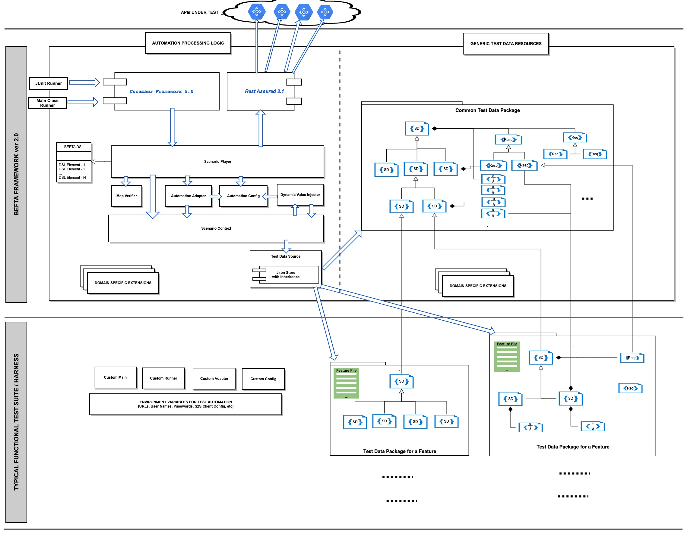
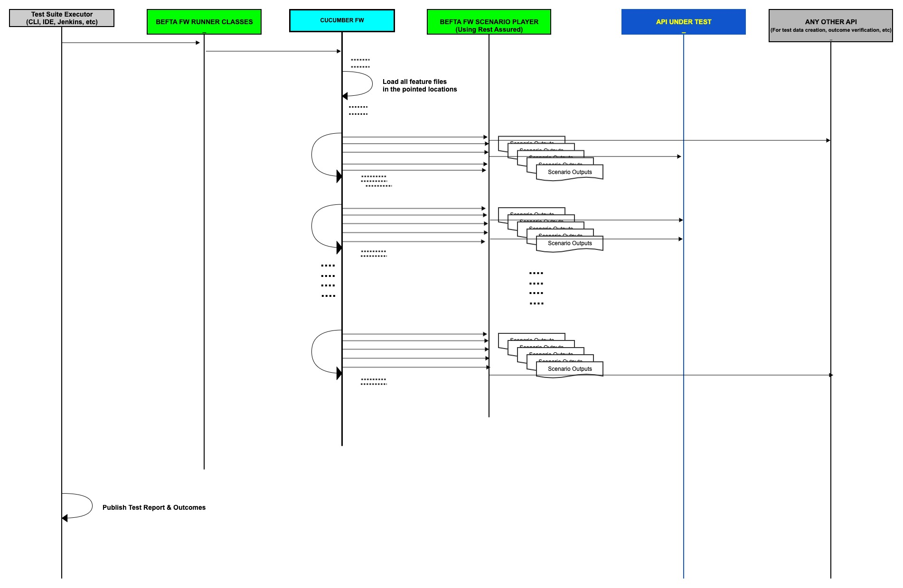

# BACK END FUNCTIONAL TEST AUTOMATION FRAMEWORK


## LICENSE

This project is licensed under the MIT License - see the [LICENSE](LICENSE) file for details.


## WHAT IS BEFTA FRAMEWORK?
BEFTA Framework is a framework for automation of functional tests for http-based APIs. It uses Cucumber and Rest Assured frameworks and supports a BDD (Behaviour-Driven Development) approach to software development.


## FEATURES AND CONVENIENCES PROVIDED
It provides the following functionalities and conveniences:
1.  A Domain Specific Language (DSL), which is specific to the domain of automation of http-based APIs, to describe the functional/behavioural requirements of APIs.
2.  Underlying programmatic logic to make the DSL an executable script language to execute functional tests.
3.  Flexible and efficient, JSON-based test data repository enabling test automators to define and maintain their test data with maximum re-use and minimum duplications.
4.  Fast-performing, full-range response verification, robust mechanism to assert full details of responses including response statuses, reason phrases, headers and response bodies.
5.  Dynamic data configuration means allowing dynamic & run-time-specific test data to be identified without any programming at all
6.  Custom-programmable dynamicity to allow for programmable injections into test logic
7.  Clearly designed way of adapting and integrating the framework into various API suites for any new functional test suit.
8.  Reporting, and for-diagnostic outputting
9.  Custom extensibility of out-of-the box DSL (Cucumber feature)
10. Other features coming with Cucumber Framework wrapped.


## HOW TO SETUP & INTEGRATE


### System Requirements
* System Resources (Memory, Disk, CPU) - Same for a JDK 8 installation.  \
  [Click here to see Oracle's reference for this.](https://docs.oracle.com/javase/8/docs/technotes/guides/install/windows_system_requirements.html)


### Software Requirements
* Java SE Development Kit 8 (JDK 8)
* Your Favourite IDE
* Gradle 4.10+


### Setting Up Environment
1. Install JDK 8 or higher
2. Install a command line terminal application


### Common Environment Variables
   Befta Framework uses the below environment variables:
   * TEST_URL: This is the base URL of the APIs to be tested.
   * IDAM_URL: This is the base URL of the API authenticating the users on behalf of which the API calls will 
     be delivered.
   * S2S_URL: This is the base URL of the API authenticating the client applications on behalf of which the API calls will 
     be delivered.
   * BEFTA_S2S_CLIENT_ID: Client ID of the application on behalf of which the API calls 
     will be delivered.
   * BEFTA_S2S_CLIENT_SECRET: Client Secret of the application on behalf of which the API calls 
     will be delivered.
   * BEFTA_RESPONSE_HEADER_CHECK_POLICY: This env var can be used optionally to switch the policy applied to mismatching 
     response header values. It can be one of IGNORE, JUST_WARN and FAIL_TEST. Default behaviour is to assume FAIL_TEST.


### Domain Specific Environment Variables
Below are the environment needed specifically for CCD domain.
   * DEFINITION_STORE_HOST: Base URL of the Definition Store APIs.
   * CCD_IMPORT_AUTOTEST_EMAIL: Email id of the user on behalf of which definitions 
     will be imported to Definition Store, for automated test data preparation.
   * CCD_IMPORT_AUTOTEST_PASSWORD: Password of the user on behalf of which definitions 
     will be imported to Definition Store, for automated test data preparation.


### Run BEFTA Framework Without a Build Tool
1. Download a copy of BEFTA Framework (say, version 1.2.1) in a local folder, say the root directory of an 
   IDE project in which you (will) have your automated functional tests. //TODO: fat 
   jar release of framework
2. Open your preferred terminal and change current directory to the root directory 
   of your test automation project.
3. java -cp befta-fw-1.2.1.jar uk.gov.hmcts.befta.BeftaMain 'my-feature-files/are/here, and/here, and-also/there'
   This will run the test scenarios under the local folder you specify.  \
   Test automation teams can write their simple, tiny custom Main classes to customise 
   the the test suite launching logic.


### Run BEFTA Framework With Gradle
1. Install Gradle 4.1 or higher. You can simply copy a gradle wrapper from `https://github.com/hmcts/befta-fw`.
2. Add the following dependency to your build.gradle file:  \
   `testCompile group: 'uk.gov.hmcts', name: 'befta-fw', version: '1.2.1'`
3. Add a javaExec section to wherever you want a functional test suit to be executed, 
   like below:
   ```
           javaexec {
            main = "uk.gov.hmcts.befta.BeftaMain"
            classpath += configurations.cucumberRuntime + sourceSets.aat.runtimeClasspath + sourceSets.main.output + sourceSets.test.output
            args = ['--plugin', "json:${projectDir}/target/cucumber.json", '--tags', 'not @Ignore', '--glue',
                    'uk.gov.hmcts.befta.player', 'my-feature-files/are/here, and/here, and-also/there']
        }
   ```
   You can place this block inside the
   ```
   task functional(type: Test) {
      ...
   }
   ```
   of your test automation project.  \
   Test automation teams can write their simple, tiny custom Main classes to customise 
   the the test suite launching logic.


#### Observe Cucumber Report

1. Open in your web browser the local Cucumber report file:  \
   `./⁨target⁩/cucumber⁩/⁨cucumber-html-reports⁩/overview-features.html`


#### Integrate Functional Test Suite Executions into Pipelines

We assume you will have build pipelines making gradle calls to run your automated 
functional tests which is the case for HMCTS Reform programme as seen in the open source 
repositories. However, with the simple means of test suite executions provided above, test 
suite executions can be integrated into build pipelines using Maven or any other tools 
as well. When it comes to BEFTA, test suite execution is a simple Java call to run 
a Main class with runtime arguments to specify where the features are, where the step 
implementations are and scenarios with which tags to pick up and run. You can skip 
all runtime arguments to this Main class, in which case the default arguments will 
be:
```
'--plugin', "json:${projectDir}/target/cucumber.json", '--tags', 'not @Ignore', '--glue', 'uk.gov.hmcts.befta.player', 'src/aat/resources/features'
```


#### Setting up a Local API Application under Test
The most typical use of BEFTA Framework will include running an application in local 
machine and executing a functional test suit against it. Running such applications 
in local will require application-specific setup instructions. Once such an application 
is setup correctly, BEFTA can then be used to functionally verify the behavioural requirements of any http-based API in 
local. Multiple applications from totally diverse domains can be setup in a local machine 
each having their respective base URLs, and BEFTA Framework can be used for each of 
them simply switching from one configuration to test an API to another.

In the case of HMCTS Reform CCD application suite, the local setup procedure is described 
here on the [README of the ccd-docker repository](https://github.com/hmcts/ccd-data-store-api).


#### Sample Repositories

Below are a few github repositories into which BEFTA Framework 
has been successfully integrated:  \
Some Spring Boot Applications:
* https://github.com/hmcts/ccd-data-store-api
* https://github.com/hmcts/ccd-definition-store-api
* https://github.com/hmcts/ccd-user-profile-api
* https://github.com/hmcts/ccd-case-document-am-api

Some Node.js Applications:
* https://github.com/hmcts/ccd-case-print-service
* https://github.com/hmcts/ccd-case-activity-api


## HOW TO DEVELOP A SIMPLE AUTOMATED SCENARIO
Development of an automated test scenario takes, at a high level, the below main steps:
1. Introduce a `.feature` file of any good name, and add a test scenario composed of 
   the DSL elements available with BEFTA framework.
2. Annotate the scenario with a tag starting with `S-`. This will identify the scenario 
   uniquely to the framework. Make sure this is a unique scenario ID across the entire test 
   suite being executed in a round.
3. Introduce a test data file with a good name ending with `.td.json`. The test data 
   file should be a marshaled json content of an object of class `uk.gov.hmcts.befta.data.HttpTestData`. Make 
   sure that the '_guid_' field in the file contains exactly the same text as the `S-` 
   tag of the scenario in the `.feature` file.  \
   The json-based test data can be prepared making use of inheritance mechanism provided 
   by the framework. The inheritance mechanism will be described under a separate heading. 
    \
   The test data can also contain dynamic content to be calculated in the runtime, 
   in the form of pre-defined place-holders or json-path-like formulas to refer to 
   the value of any request or response details, or any programmatically computed custom 
   placeholder. The dynamic value features will be described under a separate heading. 
4. Run your test scenario and correct any issues in the test data configuration until 
   you are sure the test data is complete and correct to supply the framework with 
   the full and precise data requirements of the scenario script in the `.feature` 
   file. You can find more about how to debug your scenarios under the dedicated header 
   below.


### Json Inheritance Mechanism - How it Works & How to Use
Attributes in an object represented by a JSON object in BEFTA-way are collated in the 
order or calculation shown in the below diagram:  \


### Dynamic Value Place-holders and Formulas - How they Work & How to Use


### How to Debug Test Scenarios


## LOW-LEVEL DESIGN
BEFTA Framework has been designed at a low level to contain components and their interactions as depicted in the below diagram. 
 \


Typical sequence of activities during the execution of test suite is as shown in the 
below Sequence Diagram:


